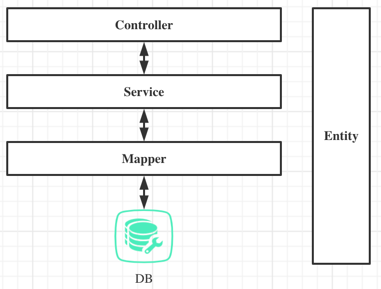
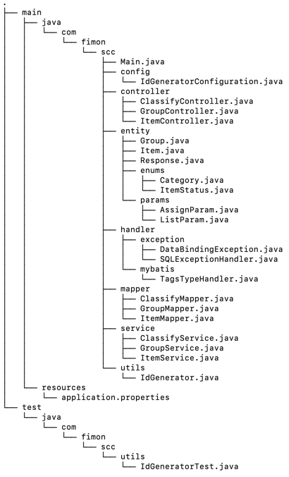

# Inventory Tracking System
For Shopify backend developer intern challenge - Summer 2022

Name: Xuhan Xie

E-mail: xuhanxie@outlook.com

## Implemented functions
- basic CRUD
- (No.5) Ability to assign/remove inventory items to a named group/collection 

## Overview
This project is implemented using **Java**, **Spring Boot** and **Maven**. Spring Boot is a very popular web development framework for Java, and Maven is for package management.

## Installation
- JDK 8+
- Maven 3.1+
- MySQL 5.7+

Run *script.sql* to generate related tables in MySQL, and fill in required fields in *resources/application.properties* to connect to MySQL (url, username, password).

```shell
mvn package

java -jar target/scc-0.0.1-SNAPSHOT.jar
```

The first command is to package the whole project and generate executable file, and the second command is to run this file. Once the project is started, you can access the API using **Postman** or other similar tools. Refer to the next part for API details.

## API Doc

Items:

| url                 | method | params                                                       |  note    |
| ------------------- | ------ | ------------------------------------------------- | ---- |
| /item/create        | POST   | (JSON){<br />name: String, required,<br />desc: String, description of item<br />category: int<br />tags: String[]<br />count:<br />status:<br />} |      |
| /item/update        | POST   | (JSON){<br />sku: String, required<br />...<br />(same fields to above, no need to include all fields, just the fields you want to update, all fields above can be modified)} |      |
| /item/details/{sku} | GET    | Sku: String, required                                        |      |
| /item/delete/{sku}  | GET    | Sku: String, required                                        |      |
| /item/count         | GET    |                                  | count of all items |
| /item/list | POST | (JSON){<br />sku: String, default 0<br />pageSize: int, default 20<br />page: int, default 1} | all params have default value; support pagination; sku is used to denote where we start, because new elements will be inserted during pagination, so recommended way is to call the function without params first, and then use sku of the first element |
|                     |        |                                                              |      |
|                     |        |                                                              |      |
|                     |        |                                                              |      |

Groups:

| url                 | method | params                                                       | note                                             |
| ------------------- | ------ | ------------------------------------------------------------ | ------------------------------------------------ |
| /group/create       | POST   | (JSON){<br />name: String, required<br />desc: String}       |                                                  |
| /group/update       | POST   | (same fields to above, include the fields you want to change) |                                                  |
| /group/details/{id} | GET    | Id: String, required                                         |                                                  |
| /group/all          | GET    |                                                              | return all groups                                |
| /group/delete/{id}  | GET    | Id: String, required                                         | it will also remove all elements from this group |
|                     |        |                                                              |                                                  |
|                     |        |                                                              |                                                  |
|                     |        |                                                              |                                                  |
|                     |        |                                                              |                                                  |

Assign to or remove from groups

| url                    | method | params                                                       | note |
| ---------------------- | ------ | ------------------------------------------------------------ | ---- |
| /classify/assign       | POST   | (JSON){<br />sku: String, required,<br />groupId: String, required} |      |
| /classify/remove/{sku} | GET    | Sku: String, required                                        |      |
|                        |        |                                                              |      |

## Implement Details

- design of the architecture

  

  file structure

  

- *utils/IdGenerator* is a simple implementation of [Snowflake Algorithm](https://github.com/twitter-archive/snowflake/blob/snowflake-2010/src/main/scala/com/twitter/service/snowflake/IdWorker.scala), it's very efficient to generate unique id, and due to the id is long (int_32) and increments, it has many other advantages when storing to database.
- In */handler*, *TagsTypeHandler* is used to convert between String[] in Java and TEXT in MySQL, and */exception* is used to process exceptions unifiedly.  
